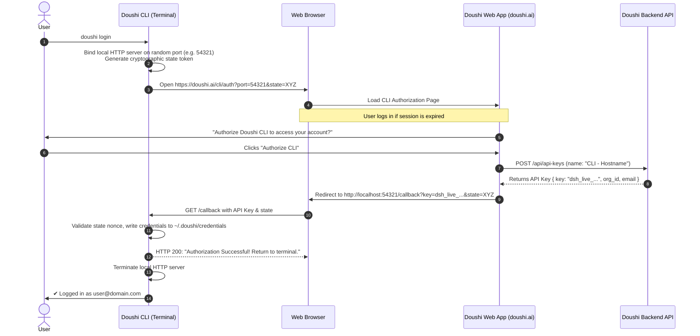

# Doushi AI CLI (`doushi` / `dsh`) Specification & Architecture

The official command-line interface for **Doushi.ai** — empowering developers and data teams to build, train, inspect, and deploy autonomous ML models directly from their terminal.

---

## 1. Vision & Core Philosophy

- **Zero-Boilerplate ML**: Go from a local dataset CSV to a production-ready hosted inference model with a single command.
- **Developer-First UX**: Beautiful terminal UI with spinners, rich colored tables, streaming agent logs, and shell completions.
- **Unix-Philosophy Compliant**: Full support for piping (`cat test.csv | doushi predict <id> | jq`), stdout redirection, and JSON outputs (`--json`).
- **No Vendor Lock-In**: One command (`doushi export`) downloads the raw scikit-learn/XGBoost/LightGBM code, Dockerfile, FastAPI microservice, and trained weights (`model.pkl`).

---

## 2. Authentication & Browser Sign-In Workflow



### Auth Modes:
1. **Interactive Browser Login (Default)**:
   ```bash
   doushi login
   ```
   Opens `https://doushi.ai/cli/auth?port=<port>&state=<nonce>` and catches the callback automatically.

2. **Headless / Remote SSH Server (`--no-browser`)**:
   ```bash
   doushi login --no-browser
   ```
   Outputs an activation URL and one-time verification code (Device Code Flow).

3. **Direct Token / API Key**:
   ```bash
   doushi login --key dsh_live_xxxxxxxxxxxxxxxx
   ```
   Or set via environment variable:
   ```bash
   export DOUSHI_API_KEY="dsh_live_xxxxxxxxxxxxxxxx"
   ```

4. **Account Inspection & Logout**:
   ```bash
   doushi whoami
   doushi logout
   ```

---

## 3. Command Hierarchy & Reference

```text
doushi [OPTIONS] COMMAND [ARGS]...

Authentication:
  login                 Authenticate CLI with Doushi.ai via browser or API Key
  logout                Remove local credentials
  whoami                Show active user, organization, and tier quota

Model Training & Project Management:
  train, create         Upload dataset and prompt to train an autonomous model
  init                  Interactive wizard for creating a project step-by-step
  projects, ls          List all projects, statuses, and performance metrics
  view <id>             Inspect project details, features, hyperparameters, and confusion matrix
  delete <id>           Delete a project and its artifacts

Inference & Deployment:
  predict <id>          Run live prediction via inline JSON, CSV file, or stdin pipe
  host <id>             Toggle dedicated sub-20ms warm EC2 hosting vs on-demand mode
  snippet <id>          Generate copy-paste code snippets (cURL, Python, TypeScript, Go)

Agent Observability & Interaction:
  logs <id> [-f]        Stream real-time training and self-healing agent sandbox logs
  chat <id>             Interactive terminal REPL to chat with the model agent
  export <id>           Download model.pkl, training script, Dockerfile, and FastAPI server

Utilities:
  demo                  Download a sample dataset (churn, housing, fraud) and test immediately
  completion            Generate shell autocompletion script (bash, zsh, fish)
  config                Get or set CLI configuration options
```

---

## 4. Key Workflows & Example Invocations

### A. One-Command Model Training
```bash
# Train on customer churn dataset with goal
doushi train ./churn_data.csv --goal "Predict customer churn probability"

# Train with specific target column override
doushi train ./housing.csv --goal "Predict house sale price" --target price
```

### B. Live Agent Streaming
```bash
# Stream agent's self-healing loop and sandbox execution in real time
doushi logs proj_982fa10c -f
```

### C. Live Predictions
```bash
# 1. Single sample JSON
doushi predict proj_982fa10c --data '{"tenure": 12, "monthly_spend": 79.5, "contract": "Month-to-month"}'

# 2. Batch predict from CSV file
doushi predict proj_982fa10c --file ./test_users.csv --output ./results.csv

# 3. Unix Pipe
cat new_records.csv | doushi predict proj_982fa10c | jq '.predictions[]'
```

### D. Interactive Terminal Chat (Agent REPL)
```bash
doushi chat proj_982fa10c
```
```text
🤖 Doushi Assistant (Connected to Project: 'Customer Churn Predictor')
> What were the top features affecting predictions?
Agent: 1. monthly_spend (32.4%)
       2. support_tickets (28.1%)
       3. tenure_months (18.6%)

> Retrain using LightGBM and handle outliers in monthly_spend
Agent: Refinement task enqueued. Triggering new sandbox run...
```

### E. Standalone Code & Model Export
```bash
doushi export proj_982fa10c --out ./exported-model/
```
**Output Directory Contents:**
```text
exported-model/
├── model.pkl            # Serialized model artifact
├── pipeline.py          # Scikit-learn / XGBoost training code
├── requirements.txt     # Locked dependencies
├── serve.py             # FastAPI microservice for local deployment
└── Dockerfile           # Production container definition
```

---

## 5. Local File System & Configuration

```text
~/.doushi/
├── credentials        # Mode 0600 file holding active API keys & tokens
└── config.json        # Global configurations (default endpoint, format, timeouts)
```

**`~/.doushi/credentials`**:
```json
{
  "current_context": "default",
  "contexts": {
    "default": {
      "user_email": "user@example.com",
      "user_id": "usr_abc123",
      "org_id": "org_personal_456",
      "api_key": "dsh_live_98a7sd8f7a9s8d7f"
    }
  }
}
```

---

## 6. Implementation Roadmap

### Phase 1: Core CLI Foundation
- [ ] Initialize Python CLI package with `typer`, `rich`, and `httpx` (or Go standalone binary).
- [ ] Implement `doushi login` with local loopback HTTP server and browser redirection.
- [ ] Implement `doushi whoami` and `doushi logout`.
- [ ] Implement `~/.doushi/credentials` security store.

### Phase 2: Project Lifecycle & Training
- [ ] Implement `doushi train <file>` with multipart upload, prompt submission, and spinner.
- [ ] Implement `doushi projects list` with formatted Rich tables.
- [ ] Implement `doushi view <id>` showing status, metrics, and dataset schema.
- [ ] Implement `doushi logs <id> -f` for live execution stream.

### Phase 3: Inference & Agent Tools
- [ ] Implement `doushi predict <id>` (JSON argument, CSV batch, and pipe support).
- [ ] Implement `doushi chat <id>` interactive REPL session.
- [ ] Implement `doushi export <id>` to download `model.pkl` + serving boilerplate.
- [ ] Implement `doushi demo` with embedded sample datasets for instant onboarding.
